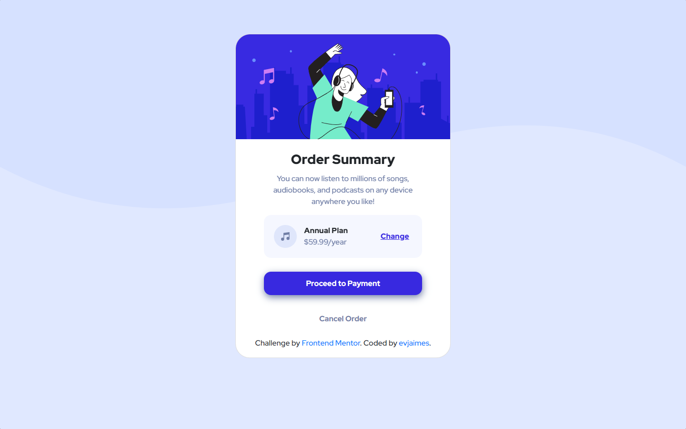

# Frontend Mentor - Order summary card solution

This is a solution to the [Order summary card challenge on Frontend Mentor](https://www.frontendmentor.io/challenges/order-summary-component-QlPmajDUj). Frontend Mentor challenges help you improve your coding skills by building realistic projects.

## Table of contents

- [Frontend Mentor - Order summary card solution](#frontend-mentor---order-summary-card-solution)
  - [Table of contents](#table-of-contents)
  - [Overview](#overview)
    - [The challenge](#the-challenge)
    - [Screenshot](#screenshot)
    - [Links](#links)
  - [My process](#my-process)
    - [Built with](#built-with)
    - [What I learned](#what-i-learned)
    - [Continued development](#continued-development)
  - [Author](#author)

## Overview

### The challenge

Users should be able to:

- See hover states for interactive elements

### Screenshot



### Links

- Solution URL: [Github](https://github.com/evjaimes/order-summary-component-main)
- Live Site URL: [Netlify](https://order-summary-evjaimes.netlify.app/)

## My process

### Built with

- HTML
- CSS
- Bootstrap
- Flexbox

### What I learned

I used this challenge to remember how to work on basic HTML, CSS and Bootstrap. Now I remember how to work with this basic elements and create small components. I like to do this kind of challenges because sometimes I'm too used to React and SaaS that when it comes to the basics I don't know what to do, I will say it's too raw that it's difficult to work with.

```css
.general {
  background: url("/images/pattern-background-desktop.svg");
  background-position: top;
  background-repeat: no-repeat;
}
```

### Continued development

I would like to work on the basics and React simultaneously, probably making the same projects but using both stacks )?. I would like to start working with Vue.js too. In matters of this project, I would like to continue working with raw CSS and basic Bootstrap grid.

## Author

- Frontend Mentor - [@evjaimes](https://www.frontendmentor.io/profile/evjaimes)
